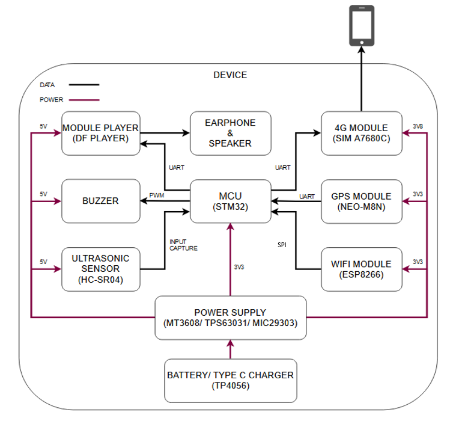

<!-- PROJECT LOGO -->
<br />
<div align="center">
  <a href="https://github.com/bitbydat/Obstacle-Detection-Device">
    
  </a>

<h3 align="center">Navigation and Obstacle Detection Device for the Visually Impaired</h3>

  <p align="center">
    My graduation project in Control and Automation Engineering (semester 2025.1)
    <br />
    <a href="https://docs.google.com/document/d/1b8eUY19hVWinYOA9YIkjcR_toliwRPs9/edit?usp=sharing&ouid=113352961761938394358&rtpof=true&sd=true"><strong>Explore the docs »</strong></a>
    <br />
    <br />
    <a href="https://github.com/bitbydat/Obstacle-Detection-Device/issues">Report Bug</a>
    ·
    <a href="https://github.com/bitbydat/Obstacle-Detection-Device/issues">Request Feature</a>
  </p>
</div>


<!-- TABLE OF CONTENTS -->
<details>
  <summary>Table of Contents</summary>
  <ol>
    <li>
      <a href="#about-the-project">About The Project</a>
      </ul>
    </li>
    <li>
      <a href="#getting-started">Getting Started</a>
      <ul>
        <li><a href="#prerequisites">Prerequisites</a></li>
        <li><a href="#installation">Installation</a></li>
      </ul>
    </li>
    <li><a href="#achievements-and-future-work">Achievements and Future Work</a></li>
     <li><a href="#contributing">Contributing</a></li>
    <li><a href="#contact">Contact</a></li>
  </ol>
</details>


<!-- ABOUT THE PROJECT -->
## About The Project

I was assigned the topic 'Design of Navigation and Obstacle Detection Device for the Visually Impaired' by my teacher for my graduation project. Below are some accompanying requirements of the project:  
- Measure the ***distance*** to obstacles and determine their ***direction***.  
- Warning mechanism using ***pre-recorded audio alerts***.  
- ***Indoor and outdoor positioning*** capability; send ***messages*** to family members' phones.  
- Equipped with a ***battery*** and ***charging circuit***.  

<!-- GETTING STARTED -->
## Getting Started

After a period of researching user needs and available devices on the market, I was able to clearly determine the key features and technologies required for my device.  
- Using 03 ***ultrasonic sensors*** to measure the ***distance*** to obstacles and determine their ***corresponding directions***.  
- Combining ***buzzez and pre‑recorded audio*** use for different obstacle distances.  
- Integrating ***GPS*** and ***LBS based on 4G and WiFi*** to determine accurately location both ***indoors and outdoors***.  
- Equipping with a ***battery*** sufficient for all‑day use and a ***USB Type‑C*** charging circuit.
<p align="left">
The detailed diagram of the hardware used for the project is shown here.<br>
</p>
  
<br>
<div align="center">
  <a href="https://github.com/bitbydat/Obstacle-Detection-Device">
    
  </a>

  Before getting started with the project, you will need the following:
| Hardware | Software |
|----------|----------|
|x01 STM32F103C8 microcontroller.| Implementing FreeRTOS to schedule tasks with precise timing|
|x03 ultrasonic sensors (HC-SR04, SRF05)| Using PWM and Input Capture for measuring with ultrasonic sensors|
|x01 DFPlayer Mini with microSD card and x01 active buzzer| Using USART protocol with the DFPlayer and a GPIO pin for the buzzer|
|x01 NEO-M8N GPS module; x01 A7680C 4G module |Using AT commands for communication over USART with DMA support|
|x01 ESP32 module for scanning WiFi and calling the Geolocation API|The ESP32 is programmed using PlatformIO and the ESP32SPISlave.h and WiFi.h libraries. SPI protocol is used for communication with STM32|


<div align="center">
  <a href="https://github.com/bitbydat/Obstacle-Detection-Device">
    
  </a>
</p>
</div>

<div align="left">

The system runs on FreeRTOS for task scheduling and consists of four main tasks:  
- Task 1 measures distance using HC-SR04 ultrasonic sensors and applies a Kalman filter to reduce noise.  
- Task 2 is triggered by a notification from Task 1 when an obstacle is detected. It processes the distance data and determines the alert mechanism via a buzzer or an MP3 module.  
- Task 3 handles positioning data by checking the validity of GPS coordinates. If not, it requests location data from LBS via the A7680C module or the ESP32.  
- Task 4  sends a text message containing the user’s location via the A7680C when it is notified by the push-button interrupt.

</div>

### Prerequisites


### Installation
<div align="left">
  
   ```sh
   git clone https://github.com/bitbydat/Obstacle-Detection-Device.git
   ```

</div>

<!-- ROADMAP -->
## Achievements and Future Work


<div align="left">

- ✔️ Detect obstacles from a distance and provided timely audio warnings.
- ✔️ Achieved reliable positioning using a combination of GPS and LBS.
- ✔️ Send SMS alerts to notify family members when the user is lost.
- ⬜ Integrate a web/app interface to allow users to easily configure the device and monitor its information. 
- ⬜ Integrate with a camera to enable object recognition and classification.
- ⬜ Design and develop a complete enclosure, integrating all components into a compact and finalized smart cane. 

</div>

<!-- CONTRIBUTING -->
## Contributing

I welcome contributions to this project. If you have suggestions, improvements, or new ideas, feel free to open an issue or submit a pull request. Your input is greatly appreciated and helps me improve.

<!-- CONTACT -->
## Contact

Dat Duy Nguyen - datndng01@gmail.com

Project Link: [https://github.com/bitbydat/Obstacle-Detection-Device/](https://github.com/bitbydat/Obstacle-Detection-Device/)

</p>
